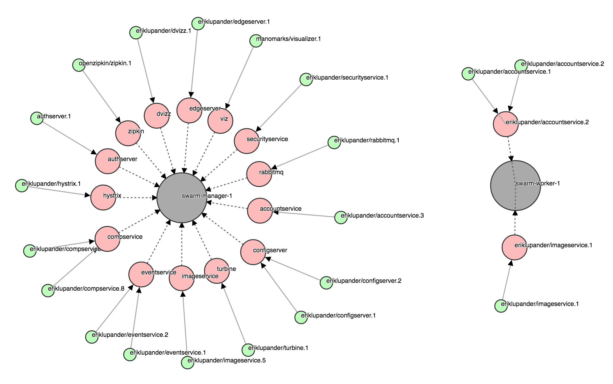

# Dvizz - A Docker Swarm Visualizer
Inspired by the excellent [ManoMarks/docker-swarm-visualizer](https://github.com/ManoMarks/docker-swarm-visualizer), Dvizz provides an alternate way to render your Docker Swarm nodes, services and tasks using the D3 [Force Layout](https://github.com/d3/d3-3.x-api-reference/blob/master/Force-Layout.md).

Legend:
- Big Gray circle: *Docker Swarm Node*
- Medium size red circle: *Docker Swarm Service*
- Small green circle: *Docker Swarm Task*

Task states
- Green: *running*
- Green with red border: *preparing*
- Gray: *allocated*

#### Why tasks and not containers?
There is an event stream one can subscribe to from the Docker Remote API that provides live updates of the state of services and containers. However, that stream only includes changes occurring on the same Swarm Node that is providing the docker.sock to the subscriber. 

Since dvizz requires us to run on the Swarm Manager, using /events stream would effectively make us miss all events emitted from other nodes in the Swarm. Since queries for *nodes*, *services* and *tasks* over the docker.sock returns the global state (i.e. across the whole swarm) we're basing Dvizz on tasks rather than containers.

An option could be to create some kind of "dvizz agent" that would need to run on each node and subscribe to that nodes very own /events channel (given that the worker nodes actually supply that?) and then use some messaging mechanism to collect events to the "dvizz master" for propagation to the GUI.

### Installation instructions
Dvizz must be started in a Docker container running on a Swarm Manager node. I run it as a service using a _docker service create_ command:

    docker service create --constraint node.role==manager --replicas 1 --name dvizz -p 6969:6969 --mount type=bind,source=/var/run/docker.sock,target=/var/run/docker.sock --network my-network --update-delay 10s --with-registry-auth  --update-parallelism 1 eriklupander/dvizz
    
Now it should be enough to point your browser at the LAN/public IP of your Docker Swarm manager node, e.g:

    http://192.168.99.100:6969
    
_(example running Docker Swarm locally with Docker Machine)_

### Building locally
The Dvizz source code is of course hosted here on github. The Dvizz backend is written in Go so you'll need the Go SDK to build it yourself. 

Clone the repository
    
    git clone https://github.com/eriklupander/dvizz

Build an linux/amd64 binary (on OS X, change "darwin" to "windows" or whatever if you're on another OS)

    export GOOS=linux
    export CGO_ENABLED=0
    go build -o dvizz-linux-amd64
    export GOOS=darwin

The sample Dockerfile looks like this:

    FROM iron/base
    
    EXPOSE 6969
    ADD dvizz-linux-amd64 dvizz-linux-amd64
    ADD static/*.html static/
    ENTRYPOINT ["./dvizz-linux-amd64"]
    
## How does it work?

The heart is the Go-based backend that uses [Go Dockerclient](github.com/fsouza/go-dockerclient) to poll the Docker Remote API every second or so over the _/var/run/docker.sock_. If the backend cannot access the docker.sock on startup it will panic which typically happens when one tries to (1) run Dvizz on localhost or (2) on a non Swarm Manager node.

The backend then keeps a diff of Swarm Nodes, Services and Tasks that's updated every second or so. Any new/removed tasks or state changes on running tasks are propagated to the web tier using plain ol' websockets.

In the frontend, the index.html page will perform an initial load using three distinct REST endpoints for /nodes, /services and /tasks. The retrieved data is then assembled into D3 _nodes_ and _links_ using the loaded data. Subsequent swarm changes are picked up from events coming in over the web socket, updating the D3 graph(s) and for state updates the SVG DOM element styling.   
  
# Known issues
- Paths rendered after inital startup are drawn on top of existing circles.
- Behaviour when new Swarm Nodes are started / stopped is somewhat buggy.
- D3 force layout seems to push new nodes off-screen. Swarm Nodes should have fixed positions?
- The styling is more or less ugly :)

# TODOs
- Expand the functionality of the onclick listener. Currently, it just logs the node state to the console.
- Style, fix layout etc.
- Fix the line rendering. Either redraw the circles or use a custom line drawing that will "end" the line at the same offset as the r of the circle it connects to.
- Introduce state rendering for the Swarm Nodes, now they always looks the same regardless of actual state.

# 3rd party libraries
- d3js.org (https://d3js.org/)
- go-underscore (https://github.com/ahl5esoft/golang-underscore)
- go-dockerclient (https://github.com/fsouza/go-dockerclient)
- gorilla (https://github.com/gorilla/websocket)
  
# License
MIT license, see [LICENSE](https://github.com/eriklupander/dvizz/blob/master/LICENSE)
